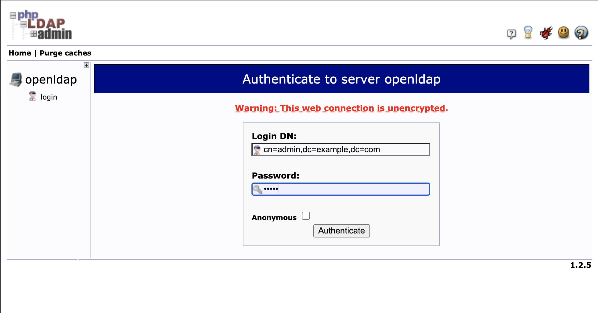
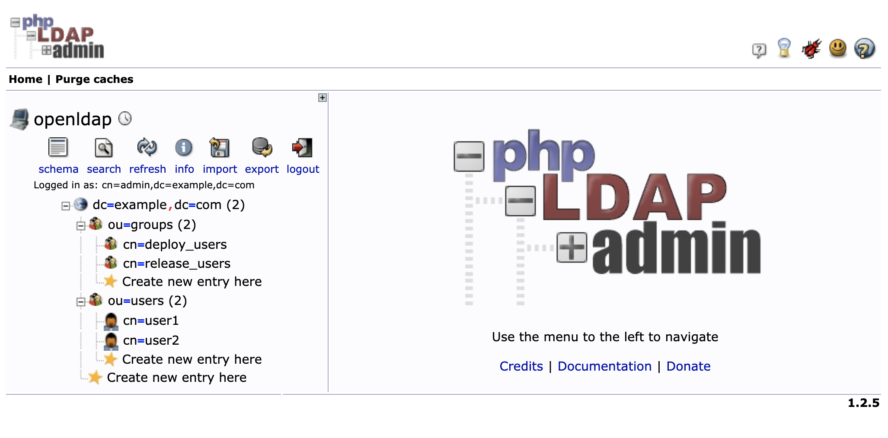
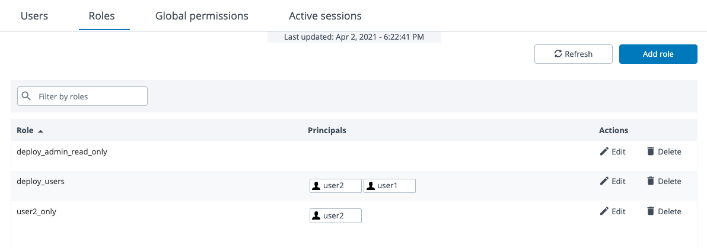
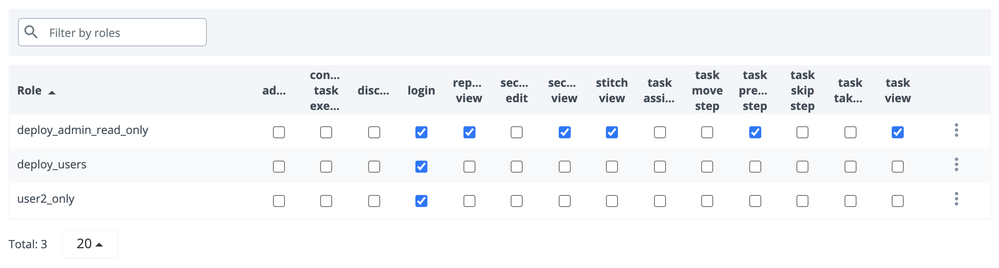
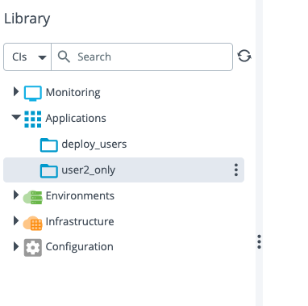
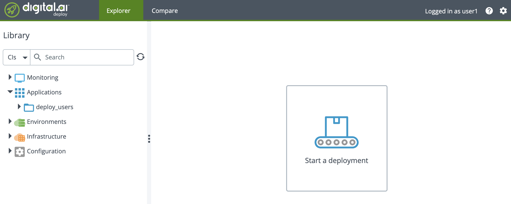
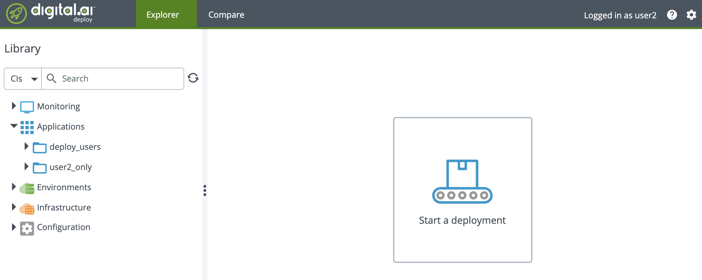
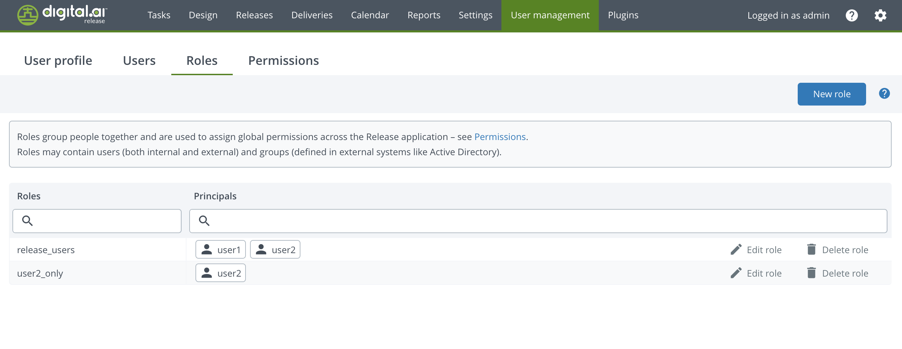
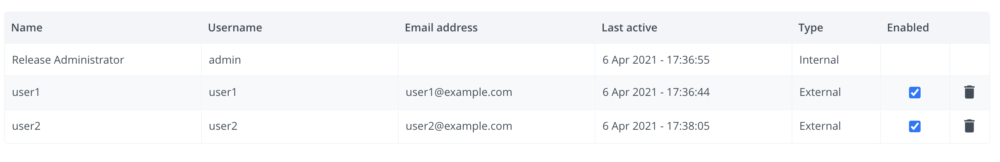

# xld-ldap-sample
Sample configuration for Digital.ai Deploy & Release with OpenLDAP

## Installation

Clone this repository:

```
git clone git@github.com:sblin/xld-ldap-sample.git
```

If you have a valid Deploy license file, put it in the `xl-deploy-server/conf` directory. Otherwise Deploy will start with a trial license.

If you have a valid Release license file, put it in the `xl-release-server/conf` directory. Otherwise Release will start with a trial license.

From the root project, run the command:
```
docker-compose up
```

The command starts four docker containers:

1. OpenLDAP running at port 389 (accessible only from the containers)
2. Deploy v10.0.0 running at port 4516 (admin/admin) and configured with the OpenLDAP server.
3. Release v10.0.1 running at port 5516 (admin/admin) and configured with the OpenLDAP server.
3. A LDAP client (phpldapadmin) available at http://localhost:8080

Check the log and wait for Deploy and Release to be started.

OpenLDAP is configured with 2 users, `user1` and `user2` with password = `password`.
Both users are members of the `deploy_users` and `release_users` groups.

## Verification
Connect to OpenLDAP at http://localhost:8080 and verify that the default users and group have been created:


Connection            |  Configuration
:-------------------------:|:-------------------------:
  |   

## Deploy configuration 

Follow these steps to configure Deploy:

1. Add two roles, `deploy_users` and `user2_only` configured like below:



2. In the Global Permissions, add the `login` permission to the new roles:



3. For demo purpose, create two folders under Applications, `deploy_users` and `user2_only` and set permissions the `read` respectively to role `deploy_users` and `user2_only`.



4. Connect to Deploy with user1, you chould see only folder `deploy_users`



5. Connect to Deploy with user2, you should see the two folders.



## Release configuration

Follow these steps to configure Release:

1. Add two roles, `release_users` and `user2_only` configured like below:



2. Create two folders, `all_users` and `user2_only`. In the folder `all_users` create a team associated with the role and add the team to the `View Folder` permission. Do the same for the other folder.

3. Connect to user1. You should see only one folder.
4. Connect to user2. You should see the two folders.
5. Connect as admin and check the user management window. You now see two users, defined as external users.

